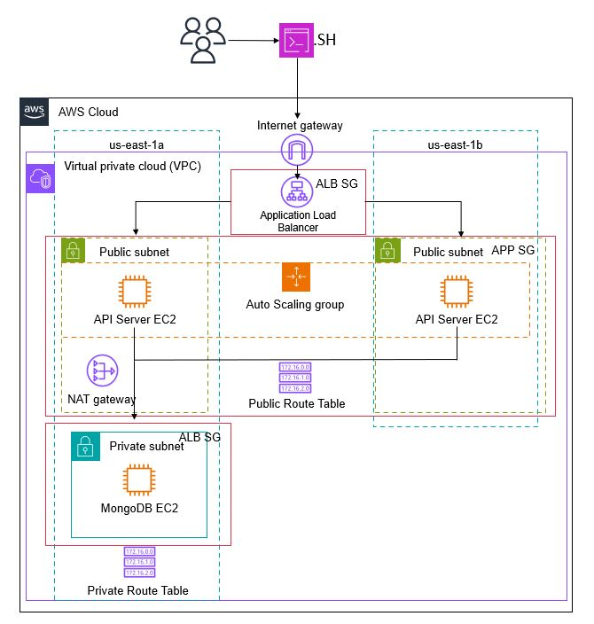

# Project 2 - API Server and Databases

This project deploys a Nodejs API microservice connected to a MongoDB database using Bash Script. This API will have exposed endpoints that users can send HTTP requests to and get a response as JSON payloads. 

This project is composed of a main script (api_server_db.sh) and auxiliary scripts. The main script is responsible for deploying the AWS cloud infrastructure using AWS CLI. Specifically, the AWS architecture will have a VPC, internet gateway, two public subnets, public route table, public EC2 instances, auto-scaling group, application load balancer, security groups, NAT Gateway, one private subnet, private route table, and private EC2 instance.

URL for the public GitHub repo: https://github.com/caroldelwing/WCD-DevOps/tree/main/project_2

## Table of contents

- [Getting Started](#getting-started)
- [Installation](#installation)
- [Usage](#usage)
- [Testing the Results](#testing-the-results)
- [Authors](#authors)

## Getting Started

To be able to run the script, you'll need an AWS account, an IAM (Identity and Access Management) user with the right permissions, and a secret access key (download the file with your secret access key, you'll need it later). We used a user with the 'AdministratorAcess' policy attached. For more info about IAM users and secret access keys, go to:
https://docs.aws.amazon.com/IAM/latest/UserGuide/id_users_create.html
https://docs.aws.amazon.com/powershell/latest/userguide/pstools-appendix-sign-up.html

Once the user is created on the AWS Console, open a new Linux terminal in your machine, and install AWS CLI.

Use the following command to install AWS CLI:

```sh
$ curl "https://awscli.amazonaws.com/awscli-exe-linux-x86_64.zip" -o "awscliv2.zip"
$ unzip awscliv2.zip
$ sudo ./aws/install
```

Access the following link for more info about how to install AWS CLI:
https://docs.aws.amazon.com/cli/latest/userguide/getting-started-install.html

To have access to your AWS account through your IAM user, execute the following command in your terminal:

```sh
$ aws configure
AWS Access Key ID [None]: paste your access key id
AWS Secret Access Key [None]: paste your secret access key
Default region name [None]: us-east-1
Default output format [None]:
```
## Installation

Option 1: Clone this repository. For this option, you will need to install Git on your terminal first, then clone the repository:

To install Git, please go to this link and follow the steps:
https://git-scm.com/book/en/v2/Getting-Started-Installing-Git

Cloning the repository:

```sh
$ git clone https://github.com/caroldelwing/WCD-DevOps
```

Option 2: Download the scripts and save them on your local machine.

## Usage

To execute the script in your terminal, navigate to the folder where the scripts are stored. Then, grant execution permission to the main script (api_server_db.sh). Lastly, execute the main script.

Running the script:

```sh
$ chmod +x api_server_db.sh
$ ./api_server_db.sh
```

The main script is responsible for creating the cloud architecture, while the userdata.sh auxiliary script is used for the database EC2 instance at the launch time, and it's responsible for installing MongoDB, creating the database, and collection using data from a csv file. Lastly, the userdata_app.sh script is used by the application EC2 instance at launch time and it's responsible for calling and runing the js application. 

## Testing the Results

The csv file called "nhl-stats-2022.csv" has data on NHL hockey players, their goals, assists and points.
After executing the main script, go to your AWS account on the console in the region you launched the AWS infrastructure, click on EC2 dashboard, and then on Load Balancer. Select the project_2 Load Balancer, copy its DNS name, and paste it into your web browser followed by the desired route:

route "/" -> returns all documents in the nhl_stats_2022 collection.
route "/players/top/:number" -> returns top players. For example, /players/top/10 will return the top 10 players leading in points scored.
route "/players/team/:teamName" -> returns all players of a team. For example, /players/team/TOR will return all players of Tornto Maple Leafs.
route "/teams" -> returns a list of all teams.

## Diagram


## Authors

- Beatriz Carvalho de Oliveira - https://github.com/beatrizCarvalhoOliveira
- Carolina Delwing Rosa - https://github.com/caroldelwing
- Zakiir Juman - https://github.com/zakiirjuman
