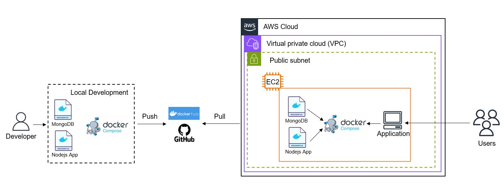

# Projects 3 and 4 - Containerizing an Application & Docker-Compose

This project deploys a containerized web application on AWS. The application comprises a MongoDB database and an API server, which exposes endpoints so users can send HTTP requests and get a response. The node.js application and mongodb database were containerized separetely, and deployed using Docker-compose in an EC2 instance on AWS. Thus, the endpoint was accessed using the public IP of the EC2 instance.

This repository is composed of two Dockerfiles (Dockerfile.app and Dockerfile.mongodb), one docker-compose file (docker-compose.yml), one dependencies file (package.json), the database content file (nhl-stats-2022.csv, list of hockey players and their stats), the nodejs application code (app.js), and one script to create and setup the mongobd collection (import.sh).

URL for the public GitHub repository: https://github.com/caroldelwing/WCD-DevOps

## Table of contents

- [Prerequisites](#prerequisites)
- [Getting Started](#getting-started)
- [Installation](#installation)
- [Usage](#usage)
- [Testing the Results](#testing-the-results)
- [Authors](#authors)

## Prerequisites

- AWS account;
- Access to a terminal;
- Basic knowledge of Git. 

## Getting Started

Using AWS Console, launch an EC2 instance with an Ubuntu 20.04 AMI, t2.micro size, key-pair, and with the option to assign a Public IPV4 enabled. Besides, set up the security group to allow, from anywhere, SSH connection (port 22), HTTP/HTTPS access (ports 80 and 443), and custom TCP (port 3000)

## Installation

In your terminal, SSH into your EC2 instance:

```sh
ssh -i <YOUR_KEY_PAIR> ec2-user@<YOUR_EC2_PUBLIC_IP>
```

Then, install Git and Docker:

```sh
sudo apt-get update
sudo apt-get install -y git
```
https://git-scm.com/book/en/v2/Getting-Started-Installing-Git

For Docker and docker-compose installation, check the following link and proceed with the provided steps:
https://docs.docker.com/engine/install/

## Usage

In your EC2 terminal, clone this repository using the following command:

```sh
$ git clone https://github.com/caroldelwing/WCD-DevOps.git
```

CD into the correct folder (project_34), and run the docker-compose file using the following command:

```sh
$ sudo docker-compose up
```

## Testing the Results

Copy the public IP of your EC2 instance, and paste it on your web browser according to the model below, editing the route according to the desired output:
<PublicIPV4>:3000/

Available routes:

- `/` - returns all documents in the nhl_stats_2022 collection.
- `/players/top/:number` - returns top players. For example, /players/top/10 will return the top 10 players leading in points scored.
- `/players/team/:teamname` - returns all players of a team. For example, /players/team/TOR will return all players of Toronto Maple Leafs.
- `/teams` - returns a list of the teams.

## Diagram



## Authors

- Beatriz Carvalho de Oliveira - https://github.com/beatrizCarvalhoOliveira
- Carolina Delwing Rosa - https://github.com/caroldelwing
- Zakiir Juman - https://github.com/zakiirjuman
