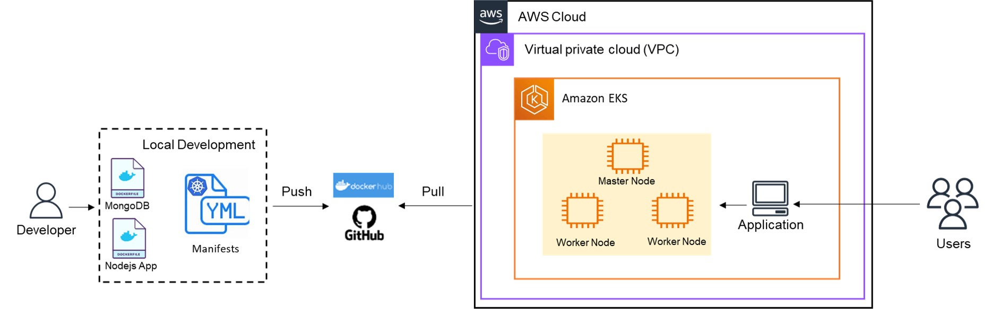

# Projects 5 - Deploying a WebApp in an EKS Cluster

This project deploys a containerized web app onto a two-worker-node cloud production Kubernetes cluster (EKS) that can be consumed by users on the public internet. The orchestration of the containers is done using the Kubernetes stack.

This repository is composed of two Deployment YAML files (app-deployment.yaml, mongo-deployment.yaml), and two service YAML files (app-service.yaml, mongo-service.yaml). While the deployment manifests are responsible for deploying the nodejs application and mongoDB database in different pods, the service manifests are responsible for exposing the Pods over a network, defining a logical set of endpoints along with a policy about how to make those pods accessible.

URL for the public GitHub repository: [https://github.com/caroldelwing/WCD-DevOps/tree/main/project_5]

## Table of contents

- [Prerequisites](#prerequisites)
- [Getting Started](#getting-started)
- [Installation](#installation)
- [Usage](#usage)
- [Testing the Results](#testing-the-results)
- [Authors](#authors)

## Prerequisites

- AWS account;
- IAM user with sufficient rights;
- Access to a terminal;
- Have AWS CLI, kubectl, and Git installed in your machine;
- Basic knowledge of Docker, Kubernetes, AWS EKS, and Git. 

## Getting Started

Set up the AWS EKS infrastructure:
-  Create a VPC for the Worker Nodes using a CloudFormation Template (choose the private and public subnets option)
https://docs.aws.amazon.com/eks/latest/userguide/creating-a-vpc.html

For the next steps, you can check the AWS documentation for a more detailed explanation:
https://docs.aws.amazon.com/eks/latest/userguide/getting-started-console.html#eks-launch-workers

- Create a cluster IAM role and attach the required Amazon EKS IAM managed policy to it

- Create the EKS Cluster:
	- Give it a name, select the latest version, and select the EKS IAM Role you just created
	- Select the created VPC, subnets, and security group created with the CloudFormation template
	- Set the cluster endpoint access as Public and Private
	- Leave the other options as default and create the cluster (it takes about 15 minutes)

- Connect Kubectl with your EKS Cluster
	- In your terminal, run aws configure (use the same user that created the EKS Cluster on the console), and install kubectl (check the installation section)
	- Then, run the following command with the name of your cluster and correct region:
	```sh
	$ aws eks update-kubeconfig --name EKS-Lab --region us-east-1
	```
	- Last, run kubectl cluster-info to check if the connection was successfull
If you get an error, you might find the answer here:
https://docs.aws.amazon.com/eks/latest/userguide/troubleshooting.html#unauthorized

- Create an EC2 IAM Role for the Node Group

- Create the Node Group
	- In the EKS Cluster page, select your cluster, then click on Compute, and add a Node Group
	- Give it a name, select the Node Group IAM role, and click on next
	- Select the Amazon Linux 2 AMI, On-Demand capacity, t2.micro size, 20GiB disk size, and click on next
	- Enable remote access, select your SSH key-pair (it might be useful for troubleshooting), and allow SSH remote access from all
	- Click on next, review, and create (it takes a few minutes)
 
## Installation

To install the required tools, follow the steps in the links bellow :

- AWS CLI:
https://docs.aws.amazon.com/cli/latest/userguide/getting-started-install.html

- Git:
  https://git-scm.com/book/en/v2/Getting-Started-Installing-Git

- Kubectl:
  https://kubernetes.io/docs/tasks/tools/

## Usage

- Once the EKS Cluster and Node Group was created, clone this repository:
```sh
$ git clone https://github.com/caroldelwing/WCD-DevOps.git
```

- Go to project_5 folder and you'll find the manifests. Deploy the application by running these commands:
```sh
kubectl -f apply mongo-service.yaml
kubectl -f apply mongo-deployment.yaml
kubectl -f apply app-service.yaml
kubectl -f apply app-deployment.yaml
```
## Testing the Results

 In your terminal, use the following command to get the external ip of the load balancer:
 ```sh
kubectl get services
```
Paste the load balancer external ip (which is the load balancer address) in your browser and add the desire route. 

Available routes:

- `/` - returns all documents in the nhl_stats_2022 collection.
- `/players/top/:number` - returns top players. For example, /players/top/10 will return the top 10 players leading in points scored.
- `/players/team/:teamname` - returns all players of a team. For example, /players/team/TOR will return all players of Toronto Maple Leafs.
- `/teams` - returns a list of the teams.

## Diagram



## Authors

- Beatriz Carvalho de Oliveira - https://github.com/beatrizCarvalhoOliveira
- Carolina Delwing Rosa - https://github.com/caroldelwing
- Zakiir Juman - https://github.com/zakiirjuman
