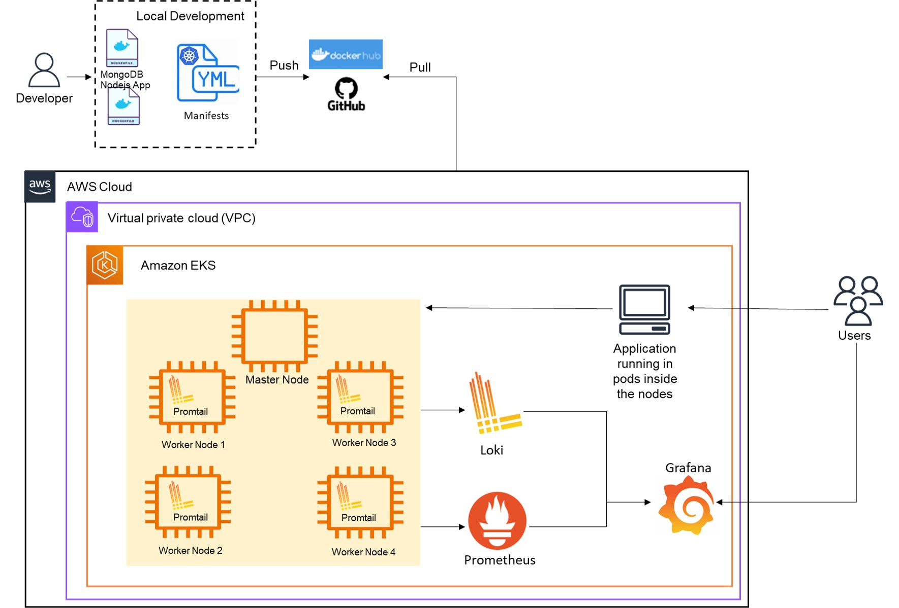

# Projects 6 - Observability Systems

This project deploys a containerized web app onto a four-worker-node cloud production Kubernetes cluster (EKS) that can be consumed by users on the public internet. The orchestration of the containers is done using the Kubernetes stack, and the cluster is actively monitored by an observability system (Grafana, Loki for logs, and Prometheus for metrics).

This repository is composed of two Deployment YAML files (app-deployment.yaml, mongo-deployment.yaml), and two service YAML files (app-service.yaml, mongo-service.yaml). While the deployment manifests are responsible for deploying the Nodejs application and mongoDB database in different pods, the service manifests are responsible for exposing the Pods over a network, defining a logical set of endpoints, along with a policy about how to make those pods accessible.

This README file will briefly describe the steps to launch an EKS cluster, the web application, and the observability system.

URL for the public GitHub repository: [https://github.com/caroldelwing/WCD-DevOps/tree/main/project_6]

## Table of contents

- [Prerequisites](#prerequisites)
- [Installation](#installation)
- [Getting Started](#getting-started)
- [Usage](#usage)
- [Testing the Results](#testing-the-results)
- [Authors](#authors)

## Prerequisites

- AWS account;
- IAM user with sufficient rights;
- Access to a terminal;
- Have AWS CLI, kubectl, helm and Git installed on your machine;
- Basic knowledge of Docker, Kubernetes, AWS EKS, and Git. 

## Installation

To install the required tools, follow the steps in the links below:

- AWS CLI:
https://docs.aws.amazon.com/cli/latest/userguide/getting-started-install.html

- Git:
https://git-scm.com/book/en/v2/Getting-Started-Installing-Git

- Kubectl:
https://kubernetes.io/docs/tasks/tools/

- Docker:
https://docs.docker.com/engine/install/

- Helm:
https://helm.sh/docs/intro/install/

## Getting Started

- Set up the AWS EKS cluster following the steps in the README file of the previous project (https://github.com/caroldelwing/WCD-DevOps/edit/main/project_5/README.md), personalizing the following parameters:
    - Use the "Public Subnets" CloudFormation template to create the VPC (let's keep it simple!);
    - When creating the NodeGroup, select t2.small as instance type, set the desired number of nodes to 4, minimum size to 2, and maximum size to 6;
    - Connect to your EKS cluster via CLI.


- Create a monitoring namespace and install Kube-Prometheus Stack, which is responsible for installing Prometheus and Grafana in your cluster.
```sh
kubectl create namespace monitoring
helm repo add prometheus-community https://prometheus-community.github.io/helm-charts
helm repo update
helm install monitoring prometheus-community/kube-prometheus-stack -n monitoring
```

- Access Grafana using port-forwarding: execute the command below and then type http://127.0.0.1:8080/ on your web browser. User is admin and password is prom-operator.
```sh
kubectl port-forward service/monitoring-grafana 8080:80 -n monitoring
```

- The Kube-Prometheus-Stack has many dashboards ready to monitor your cluster; you can access them in the section "Dashboards" of Grafana. I also suggest you import the following dashboards: 15757, 15758, 15759, and 15760 for a better visualization of your cluster metrics.

- Now, install Loki:
```sh
kubectl create namespace logging
helm repo add grafana https://grafana.github.io/helm-charts
helm repo update
helm upgrade --install loki --namespace=monitoring grafana/loki-stack --set grafana.enabled=false --set loki.enabled=true --set loki.promtail.enabled=true
```
- Add Loki as Data Source in Grafana, using the URL http://loki:3100. Then, import the dashboard ID 12611 for logs visualization.

## Usage

- Once the EKS Cluster, Node Group, and the monitoring stack are running, clone this repository:
```sh
$ git clone https://github.com/caroldelwing/WCD-DevOps.git
```

- Go to project_6 folder, and you'll find the manifests. Deploy the application by running these commands:
```sh
kubectl apply -f mongo-service.yaml
kubectl apply -f mongo-deployment.yaml
kubectl apply -f app-service.yaml
kubectl apply -f app-deployment.yaml
```

## Testing the Results

- Again, access Grafana using port-forwarding: execute the command below and then type http://127.0.0.1:8080/ on your web browser. User is admin and password is prom-operator.
```sh
kubectl port-forward service/monitoring-grafana 8080:80 -n monitoring
```
- Open the dashboards you imported previously and have fun! :)
- Don't forget to delete everything once you're finished to avoid unnecessary costs.

## Diagram



## Authors

- Beatriz Carvalho de Oliveira - https://github.com/beatrizCarvalhoOliveira
- Carolina Delwing Rosa - https://github.com/caroldelwing
- Zakiir Juman - https://github.com/zakiirjuman
