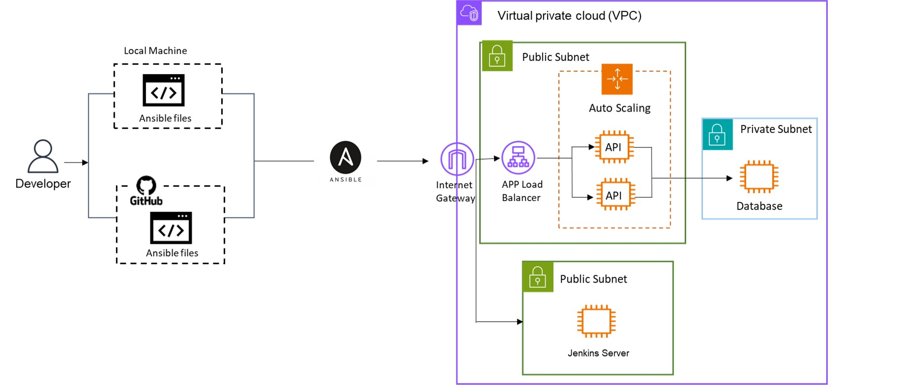
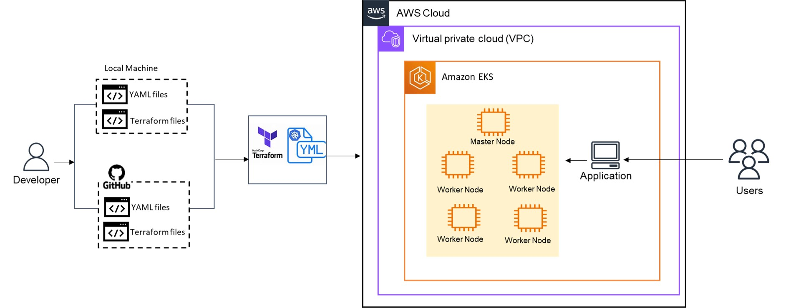

# Project 7 -  Infrastructure Provisioning Automation with Ansible and Terraform

This project deploys AWS infrastructure using infrastructure provisioning automation tools (Infrastructure as Code). There are three sets of infrastructure components that will be deployed on AWS:
- EC2 servers to host a web app architecture with API and Database (using Ansible);
- EC2 instance hosting a Jenkins server (using Ansible);
- Functional AWS EKS cluster hosting a web app with API and Database (using Terraform).

This repository is composed of the following YAML, Terraform, and Bash Script files:
- Part 1: infra.ansible.yaml, userdata.sh, userdata_app.sh.
- Part 2: jenkins.ansible.yaml,jenkinsinfra.ansible.yaml.
- Part 3: app-deployment.yaml, mongo-deployment.yaml, app-service.yaml, mongo-service.yaml, eks-cluster.tf, main.tf, outputs.tf, terraform.tf, variable.tf, vpc.tf.

URL for the public GitHub repository: [https://github.com/caroldelwing/WCD-DevOps/tree/main/project_7]

## Table of contents

- [Prerequisites](#prerequisites)
- [Installation](#installation)
- [Getting Started](#getting-started)
- [Usage](#usage)
- [Testing the Results](#testing-the-results)
- [Authors](#authors)

## Prerequisites

- AWS account;
- IAM user with sufficient rights;
- Access to a Linux terminal;
- Have AWS CLI, git , python3, pip, botocore, boto3, ansible and Terraform CLI installed on your Linux machine;
- Basic knowledge of Ansible, Terraform, AWS EKS, and Git. 

## Installation

To install the required tools, follow the steps in the links below:

- AWS CLI:
https://docs.aws.amazon.com/cli/latest/userguide/getting-started-install.html

- Git:
https://git-scm.com/book/en/v2/Getting-Started-Installing-Git

- Ansible:
https://docs.ansible.com/ansible/latest/installation_guide/intro_installation.html

- Terraform:
https://developer.hashicorp.com/terraform/tutorials/aws-get-started/install-cli

- Python3, pip, botocore, boto3:
```sh
#Python3
sudo apt update
sudo apt install python3

#pip
sudo apt install python3-pip

#botocore and boto3
pip3 install botocore boto3
```

## Getting Started

- To have access to your AWS account through your IAM user, execute the following command in your terminal
```sh
$ aws configure
AWS Access Key ID [None]: paste your access key id
AWS Secret Access Key [None]: paste your secret access key
Default region name [None]: us-east-1
Default output format [None]:
```

- In your terminal, clone this repository and navigate to the project 7 folder:
```
git clone https://github.com/caroldelwing/WCD-DevOps
cd WCD-DevOps/project_7
```
 Make sure your path to project 7 is **home/ubuntu/WCD-DevOps/project_7**, otherwise, you will have to edit the path in the part 2 Ansible files.

## Usage

- Execute the Ansible playbooks in the following order (parts 1 and 2):
```sh
ansible-playbook infra.ansible.yaml
ansible-playbook jenkinsinfra.ansible.yaml
ansible-playbook -i hosts jenkins.ansible.yaml
```

- Deploy the EKS Cluster with Terraform (part 3):
```sh
terraform init
```
```sh
terraform validate
```
```sh
terraform plan
```
```sh
terraform apply -auto-approve
```

- Once your EKS cluster is up and running, configure kubectl to interact with your cluster by running this command in your terminal:
```sh
aws eks update-kubeconfig --region <region> --name <EKS_cluster_name>
```
- Then, deploy the application by running the manifests in the following order:
```sh
kubectl -f apply mongo-service.yaml
kubectl -f apply mongo-deployment.yaml
kubectl -f apply app-service.yaml
kubectl -f apply app-deployment.yaml
```

## Testing the Results
- Part 1: copy the public IP of your EC2 instances that belong to the autoscaling group, and paste it on your web browser according to the model below, editing the route according to the desired output:
<PublicIPV4>:3000/

Available routes:

- `/` - returns all documents in the nhl_stats_2022 collection.
- `/players/top/:number` - returns top players. For example, /players/top/10 will return the top 10 players leading in points scored.
- `/players/team/:teamname` - returns all players of a team. For example, /players/team/TOR will return all players of Toronto Maple Leafs.
- `/teams` - returns a list of the teams.

- Part 2: copy the public IP of the Jenkins EC2 instance and paste it on your web browser according to the model below:
<PublicIPV4>:8080

- Part 3: use the following command to get the external ip of the load balancer:
```sh
kubectl get services
```
Paste the load balancer external ip (which is the load balancer address) in your browser and add the desired route. 

Available routes:

- `/` - returns all documents in the nhl_stats_2022 collection.
- `/players/top/:number` - returns top players. For example, /players/top/10 will return the top 10 players leading in points scored.
- `/players/team/:teamname` - returns all players of a team. For example, /players/team/TOR will return all players of Toronto Maple Leafs.
- `/teams` - returns a list of the teams.

## Diagram




## Authors

- Beatriz Carvalho de Oliveira - https://github.com/beatrizCarvalhoOliveira
- Carolina Delwing Rosa - https://github.com/caroldelwing
- Zakiir Juman - https://github.com/zakiirjuman
