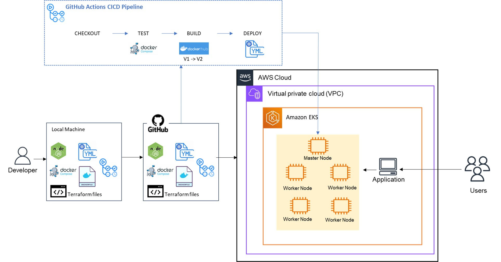

# Project 8 - CI/CD
This project deploys a CICD pipeline using GitHub Actions. The pipeline comprises checkout, test, build, and deploy stages of a web application, which is deployed in a multi-container setup in a cloud production Kubernetes cluster (EKS). The application comprises a MongoDB database and an API server, which exposes endpoints so users can send HTTP requests and get a response. 
The pipeline is trggered by pushes on the GitHub repository. In other words, each time an alteration is made to the code and pushed to the GitHub repo, the pipeline will checkout this code, test it, build a new docker image, push it to DockerHub, and deploy it in an EKS Cluster.

This project has three main sections:
- Section 1: Terraform code to deploy an EC2 instance and host a Jenkins server (this section is a requirement of the WCD course, and it's not related to the following sections);
- Section 2: Terraform code to deploy a functional AWS EKS cluster.
- Section 3: application and database code, Dockerfiles, Docker-compose file, and YAML manifests that will be used by the pipeline.
Note: the pipeline code is located in the .github folder.

URL for the public GitHub repository: [https://github.com/caroldelwing/WCD-DevOps/tree/main/project_8]

## Table of contents

- [Prerequisites](#prerequisites)
- [Installation](#installation)
- [Getting Started](#getting-started)
- [Usage](#usage)
- [Testing the Results](#testing-the-results)
- [Authors](#authors)

## Prerequisites

- AWS account;
- DockerHub account;
- IAM user with sufficient rights;
- Access to a Linux terminal;
- Have AWS CLI, git, Terraform CLI, and kubectl installed on your Linux machine;
- Basic knowledge of Ansible, Terraform, AWS EKS, and Git. 

## Installation

To install the required tools, follow the steps in the links below:

- AWS CLI:
https://docs.aws.amazon.com/cli/latest/userguide/getting-started-install.html

- Git:
https://git-scm.com/book/en/v2/Getting-Started-Installing-Git

- Terraform:
https://developer.hashicorp.com/terraform/tutorials/aws-get-started/install-cli

- Kubectl:
https://kubernetes.io/docs/tasks/tools/

## Getting Started

- To have access to your AWS account through your IAM user, execute the following command in your terminal
```sh
$ aws configure
AWS Access Key ID [None]: paste your access key id
AWS Secret Access Key [None]: paste your secret access key
Default region name [None]: us-east-1
Default output format [None]:
```

Fork this Repository:
Click the "Fork" button at the top-right corner of the repository page. This will create a copy of the repository under your GitHub account.

- In your terminal, clone the forked repository and navigate to the project 8 folder (replace the link below with the link to your repo):
```
git clone https://github.com/caroldelwing/WCD-DevOps
cd WCD-DevOps/project_8
```

- In your new GitHub repo, create secrets for your Dockerhub and AWS credentials by following the steps in the link below:
https://docs.github.com/pt/actions/security-guides/encrypted-secrets

Make sure to name your secrets exactly as below, and fill them with the values of your credentials (AWS access key and DockerHub token, which need to be created if you don't have one already):
    - DOCKERHUB_TOKEN
    - DOCKERHUB_USERNAME
    - AWS_ACCESS_KEY_ID
    - AWS_SECRET_ACCESS_KEY

## Usage

- Part 1: Deploy Jenkins Server with Terraform:
  Navigate to section_1 folder and execute the following Terraform commands:
```sh
cd WCD-DevOps/project_8/section_1
terraform init
terraform validate
terraform plan
terraform apply -auto-approve
```

- Part 2: Deploy the EKS Cluster with Terraform:
    Navigate to section_2 folder and execute the Terraform comands:
```sh
cd WCD-DevOps/project_8/section_2
terraform init
terraform validate
terraform plan
terraform apply -auto-approve
```
Once your EKS cluster is up and running, configure kubectl to interact with your cluster by running this command in your terminal:
```sh
aws eks update-kubeconfig --region <region> --name <EKS_cluster_name>
```

- Part 3:
  Change to folder .github/workflows:
```sh
cd WCD-DevOps/.github/workflows
```
  Open the cicd-pipeline.yaml file with a text editor and change the name of the docker images (lines 54 and 55) according to your Dockerhub username and desired image names. Moreover, you have to edit the docker image names in the YAML manifests located in the section_3 folder (app-deployment.yaml and mongo-deployment.yaml). Then, commit and push the changes on your GitHub repository, which will trigger the pipeline that will checkout the code, test, build the images, and deploy the application in your running EKS cluster.

```sh
#add changes you made
git add .

#commit changes you made
git commit -m "Updated image names in the pipeline and k8s manifests"

#push committed changes 
git push origin main
```

  
## Testing the Results
- Section 1: copy the public IP of the Jenkins EC2 instance and paste it on your web browser according to the model PublicIPV4:8080

- Sections 2 and 3: execute the following command in your terminal to get the external IP of the load balancer:
```sh
kubectl get services
```
Copy and paste the load balancer external IP (which is the load balancer address) in your browser and add the desired route. 

Available routes:

- `/` - returns all documents in the nhl_stats_2022 collection.
- `/players/top/:number` - returns top players. For example, /players/top/10 will return the top 10 players leading in points scored.
- `/players/team/:teamname` - returns all players of a team. For example, /players/team/TOR will return all players of Toronto Maple Leafs.
- `/teams` - returns a list of the teams.

## Diagram



## Authors

- Beatriz Carvalho de Oliveira - https://github.com/beatrizCarvalhoOliveira
- Carolina Delwing Rosa - https://github.com/caroldelwing
- Zakiir Juman - https://github.com/zakiirjuman